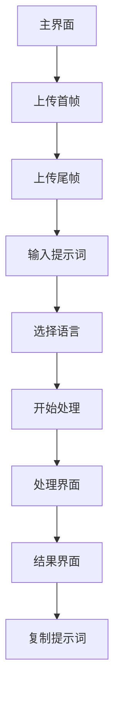

# 首尾帧视频功能产品需求文档

## 1. 产品概述

首尾帧视频功能是提示词优化器的新增核心功能，允许用户上传首帧和尾帧图片，通过AI模型分析两张图片的视觉特征和内容差异，结合用户输入的提示词，智能生成描述两帧之间平滑过渡的视频提示词。

该功能解决了视频创作中关键帧过渡描述的难题，为视频生成模型提供更精确的动态变化指导，提升视频生成的连贯性和质量。

## 2. 核心功能

### 2.1 用户角色

本功能面向所有用户，无需角色区分，所有用户均可使用完整功能。

### 2.2 功能模块

我们的首尾帧视频功能包含以下主要页面：

1. **主界面**：功能切换标签、图片上传区域、提示词输入框、处理控制按钮
2. **处理界面**：实时推理过程展示、进度条、推理日志
3. **结果界面**：优化后的过渡提示词展示、复制功能

### 2.3 页面详情

| 页面名称 | 模块名称   | 功能描述                                |
| ---- | ------ | ----------------------------------- |
| 主界面  | 功能切换标签 | 在现有的文生图、图生图、文生视频、图生视频基础上新增"首尾帧视频"标签 |
| 主界面  | 首帧上传区域 | 支持PNG/JPG格式图片上传，显示预览图，提供拖拽上传功能      |
| 主界面  | 尾帧上传区域 | 支持PNG/JPG格式图片上传，显示预览图，提供拖拽上传功能      |
| 主界面  | 提示词输入框 | 用户输入描述过渡效果的文本提示词，支持中英文              |
| 主界面  | 语言选择   | 选择输出提示词的语言（中文/英文）                   |
| 主界面  | 处理按钮   | 触发AI分析和提示词生成，显示处理状态                 |
| 处理界面 | 推理过程展示 | 实时显示AI分析首尾帧差异、构建过渡逻辑的推理步骤           |
| 处理界面 | 进度条    | 显示处理进度百分比，提供视觉反馈                    |
| 处理界面 | 推理日志   | 滚动显示详细的分析步骤和推理过程                    |
| 结果界面 | 提示词展示  | 显示生成的过渡视频提示词，支持文本选择                 |
| 结果界面 | 复制功能   | 一键复制优化后的提示词到剪贴板                     |

## 3. 核心流程

用户操作流程如下：

1. 用户在主界面选择"首尾帧视频"功能标签
2. 上传首帧图片（必需）
3. 上传尾帧图片（必需）
4. 输入描述过渡效果的提示词（可选，用于指导过渡方向）
5. 选择输出语言（中文/英文）
6. 点击"优化提示词"按钮开始处理
7. 系统进入处理界面，显示AI推理过程
8. 处理完成后展示结果界面，显示生成的过渡提示词
9. 用户可复制提示词用于视频生成

## 4. 用户界面设计

### 4.1 设计风格

* **主色调**：保持与现有界面一致的蓝色系（#3b82f6）和灰色系（#64748b）

* **按钮样式**：圆角矩形按钮，支持悬停和点击状态

* **字体**：系统默认字体，标题16px，正文14px，辅助文本12px

* **布局风格**：卡片式布局，顶部标签导航，响应式设计

* **图标样式**：简洁线性图标，上传区域使用虚线边框

### 4.2 页面设计概览

| 页面名称 | 模块名称   | UI元素                                        |
| ---- | ------ | ------------------------------------------- |
| 主界面  | 功能标签   | 在现有4个标签基础上新增第5个"首尾帧视频"标签，滑动指示器相应调整          |
| 主界面  | 图片上传区域 | 两个并排的上传区域，左侧"首帧"右侧"尾帧"，虚线边框，拖拽提示文字          |
| 主界面  | 预览区域   | 上传成功后显示缩略图，最大高度200px，支持点击查看大图               |
| 主界面  | 提示词输入  | 多行文本框，占位符文字"描述首尾帧之间的过渡效果、动作变化、场景转换等..."     |
| 主界面  | 功能说明   | 蓝色背景的提示框，说明"首尾帧视频会分析两张图片的差异，生成描述过渡过程的视频提示词" |
| 处理界面 | 推理步骤   | 专门针对首尾帧分析的推理步骤，包括图像对比、差异分析、过渡构建等            |
| 结果界面 | 提示词展示  | 浅灰色背景的文本区域，等宽字体显示，便于阅读和复制                   |

### 4.3 响应式设计

桌面优先设计，移动端自适应。在移动设备上，两个上传区域改为上下排列，确保操作便利性。

## 5. 技术实现要点

* 支持多图片上传和预览

* 图片格式验证和大小限制

* 专门的API端点处理首尾帧分析

* 流式响应展示推理过程

* 图片base64编码传输

* 错误处理和用户反馈

