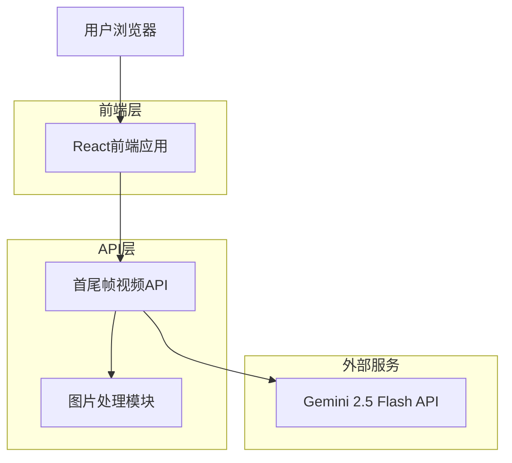
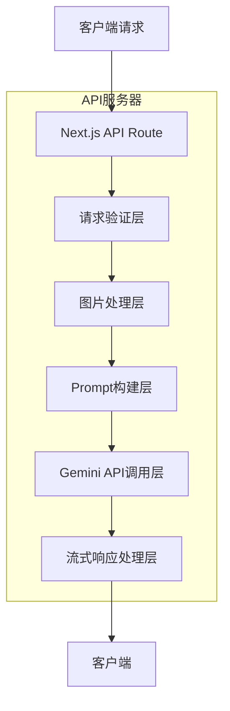

# 首尾帧视频功能技术架构文档

## 1. 架构设计



## 2. 技术描述

* 前端：React\@18 + Next.js\@14 + Tailwind CSS

* 后端：Next.js API Routes

* AI服务：Gemini 2.5 Flash API（通过AIHUBMIX代理）

* 图片处理：浏览器原生File API + Base64编码

## 3. 路由定义

| 路由                                    | 用途                   |
| ------------------------------------- | -------------------- |
| /                                     | 主页面，包含首尾帧视频功能标签      |
| /api/optimize-frame-transition/stream | 首尾帧视频提示词优化API，支持流式响应 |

## 4. API定义

### 4.1 核心API

首尾帧视频提示词优化

```
POST /api/optimize-frame-transition/stream
```

请求（FormData格式）：

| 参数名称       | 参数类型   | 是否必需  | 描述              |
| ---------- | ------ | ----- | --------------- |
| firstFrame | File   | true  | 首帧图片文件（PNG/JPG） |
| lastFrame  | File   | true  | 尾帧图片文件（PNG/JPG） |
| prompt     | string | false | 用户输入的过渡描述提示词    |
| language   | string | true  | 输出语言（'en'或'zh'） |

响应（Server-Sent Events）：

| 事件类型                        | 数据格式                                                  | 描述        |
| --------------------------- | ----------------------------------------------------- | --------- |
| response.output\_text.delta | {"type":"response.output\_text.delta","delta":"文本增量"} | 流式输出的文本增量 |
| response.completed          | {"type":"response.completed"}                         | 处理完成事件    |
| response.error              | {"type":"response.error","error":{"message":"错误信息"}}  | 错误事件      |

请求示例：

```javascript
const formData = new FormData();
formData.append('firstFrame', firstFrameFile);
formData.append('lastFrame', lastFrameFile);
formData.append('prompt', '从静态场景过渡到动态场景');
formData.append('language', 'zh');
```

响应示例：

```
data: {"type":"response.output_text.delta","delta":"一个宁静的"}

data: {"type":"response.output_text.delta","delta":"湖面开始"}

data: {"type":"response.completed"}
```

## 5. 服务器架构图



## 6. 数据模型

### 6.1 前端状态模型

```typescript
interface FrameTransitionState {
  firstFrame: File | null;
  lastFrame: File | null;
  firstFramePreview: string;
  lastFramePreview: string;
  prompt: string;
  language: 'en' | 'zh';
  loading: boolean;
  optimized: string;
  error: string;
  progress: number;
  reasoningLogs: string[];
}
```

### 6.2 API请求模型

```typescript
interface FrameTransitionRequest {
  firstFrame: File;
  lastFrame: File;
  prompt?: string;
  language: 'en' | 'zh';
}

interface StreamResponse {
  type: 'response.output_text.delta' | 'response.completed' | 'response.error';
  delta?: string;
  error?: {
    message: string;
  };
}
```

## 7. 核心实现逻辑

### 7.1 图片处理流程

1. **文件验证**：检查文件类型（PNG/JPG）和大小限制（<10MB）
2. **Base64编码**：将图片文件转换为Base64字符串
3. **图片分析**：通过Gemini Vision API分析两张图片的内容
4. **差异识别**：识别首尾帧之间的关键差异点
5. **过渡构建**：基于差异分析构建平滑过渡的描述

### 7.2 Prompt工程策略

```javascript
const buildFrameTransitionPrompt = (firstFrameBase64, lastFrameBase64, userPrompt, language) => {
  const outputLang = language === 'zh' ? '中文' : '英文';
  
  return `你是一名专业的视频过渡分析师。请分析以下两张图片（首帧和尾帧），并生成描述它们之间平滑过渡的${outputLang}视频提示词。

分析要求：
1. 仔细观察两张图片的主体、场景、光照、色彩、构图等差异
2. 识别关键的变化元素（位置移动、形态变化、环境转换等）
3. 构建连贯的过渡逻辑，确保变化自然流畅
4. 重点描述动态过程，包括运动轨迹、变化节奏、中间状态
5. 融合用户提示：${userPrompt || '无特殊要求'}

输出要求：
- 生成一段完整的${outputLang}视频提示词
- 使用逗号分隔的短语形式
- 重点描述过渡过程和动态变化
- 不包含技术参数（分辨率、帧率等）
- 确保描述连贯且适合视频生成模型

首帧图片：[图片1]
尾帧图片：[图片2]`;
};
```

### 7.3 推理步骤定义

```javascript
const frameTransitionReasoningSteps = [
  '加载并分析首帧图片内容...',
  '加载并分析尾帧图片内容...',
  '识别两张图片的主要元素差异...',
  '分析场景、光照、色彩的变化...',
  '检测主体位置和形态的变化...',
  '构建合理的过渡路径...',
  '设计中间关键帧的状态...',
  '优化动作序列和时间节奏...',
  '整合用户提示词要求...',
  '生成连贯的过渡描述...',
  '完成首尾帧过渡提示词优化...'
];
```

### 7.4 错误处理策略

* **文件格式错误**：提示用户上传PNG或JPG格式

* **文件过大**：提示压缩图片或选择较小文件

* **网络错误**：提供重试机制

* **API错误**：显示具体错误信息并提供解决建议

* **图片分析失败**：提示更换清晰度更高的图片

## 8. 性能优化

* **图片压缩**：前端自动压缩大尺寸图片

* **并发处理**：同时分析两张图片以提高效率

* **缓存策略**：缓存图片预览避免重复读取

* **流式响应**：实时展示处理进度提升用户体验

* **错误恢复**：支

